---
title: Recycling
level: Scratch +
language: en-GB
stylesheet: scratch
embeds: "*.png"
materials: ["recycling.sb2", "Resources/*.png"]
...

# Introduction {.intro}

We're going to make a recycling game! Catch the falling items, and put them in the correct recycling bins.

<div class="scratch-preview">
    <iframe allowtransparency="true" width="485" height="402" src="//scratch.mit.edu/projects/embed/57775306/?autostart=true" frameborder="0"></iframe>
    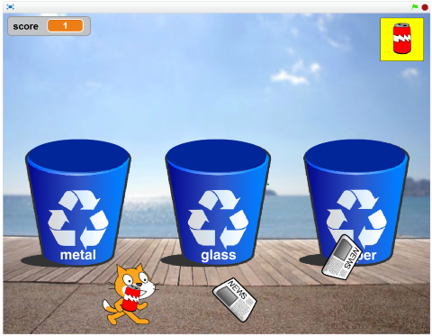
</div>

Use the arrow keys to run left and right
Press space bar to throw what you're carrying
Get the rubbish in the correct recycling bin


# Step 1: Create the character that will pick up the rubbish {.activity}

## Activity Checklist {.check}

+ Start a new Scratch project.
+ Change the name of Sprite1 to **cat** by clicking on the blue `i` symbol
+ Make sure that it will only flip left-right with the side-to-side arrow.
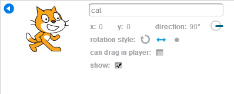
+ Create a variable, for this sprite only, called **runningspeed**
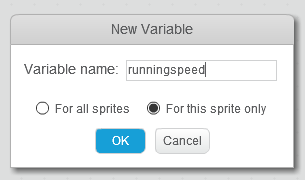
+ Create a variable, for this sprite only, called **maxspeed**
+ Create a variable, for this sprite only, called **cats-direction**
+ Untick all three variables so they're not shown on the Stage
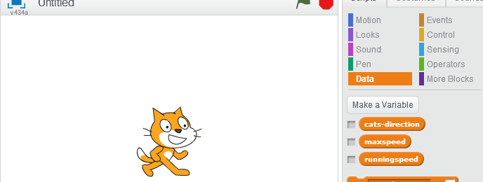
+ Use the **Make a Block** button in **More Blocks** to create a new custom block
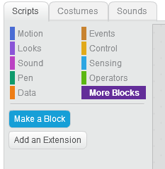
+ Name the new custom block **reset**
+ Add a script to the **reset** block that will put the cat in the right starting place and set the speed variables
```blocks
define reset
    set size to (70)%
    go to x: (0) y: (-135)
    point in direction (90 v)
    set [runningspeed v] to (0)
    set [maxspeed v] to (10)
    set [cats-direction v] to (90)
```
+ Create another custom block, called **run**
+ Add the following script to **run**, to make it possible for the cat to run at the **runningspeed**, and slow down gradually
```blocks
define run
forever
	move (runningspeed) steps
	if <(runningspeed) > (0)> then
		change [runningspeed v] by (-1)
	else
		if <(runningspeed) < (0)> then
			change [runningspeed v] by (1)
        end
    end
```
+ Combine these when the green flag is clicked
```blocks
when green flag clicked
    reset :: custom
    run :: custom
```
+ Create a custom block called "**change direction if needed**". It should take one **number input** called **direction**
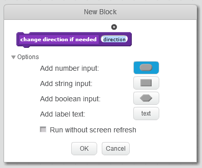
```blocks
define change direction if needed (direction)
if <not <(cats-direction) = (direction)>> then
	point in direction (direction)
	set [cats-direction v] to (direction)
	set [runningspeed v] to <(0) - (runningspeed)>
end
```
+ Create a custom block called **speed up if possible** which will increase speed, but only until the cat reaches **maxspeed**
```blocks
define speed up if possible
if <(runningspeed) < (maxspeed)> then
    change [runningspeed v] by (2)
end
```
+ Start to bring these together with a new custom block called **handle button press** which takes one **number input** called **button-direction**
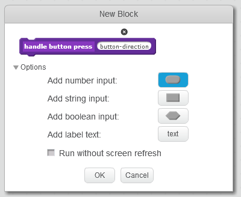
```blocks
define handle button press (button-direction)
change direction if needed (button-direction) :: custom
speed up if possible :: custom
next costume
```
+ Finally, add a script block that will use these custom blocks to control the cat's running
```blocks
when green flag clicked
forever
	if <key [left arrow v] pressed?> then
		handle button press (-90) :: custom
    end
	if <key [right arrow v] pressed?> then
		handle button press (90) :: custom
    end
```
+ Duplicate each of the cat's two costumes. We want two of the first costume, and two of the second costume. This will prevent the running animation from flickering too much
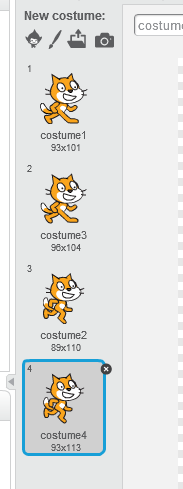

## Save your project {.save}

## Test Your Project {.flag}

Click the green flag.

+ Use the left and right arrows to run from side to side
+ If you let go of the arrow key after picking up speed, the cat should slow down gradually instead of stopping instantly
+ If you switch directions while running, the cat should skid in the wrong direction briefly before switching

## Things to try {.try}

+ Try adjusting the speeds - the number in **speed up if possible** controls how fast the cat accelerates, the **maxspeed** value in **reset** controls the cat's top speed.

# Step 2: Add falling rubbish {.activity .new-page }

It's time to make items for the cat to recycle!

## Activity Checklist {.check}

##### Prepare the sprite
+ Upload a new sprite, choosing **Resources/can.png**
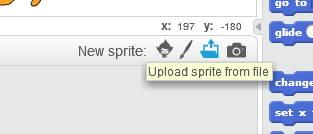
+ Switch to the **Costumes** tab, and upload another costume using **Resources/jar.png**
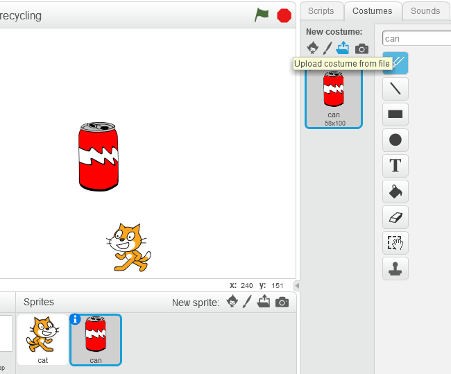
+ Upload another costume using **Resources/newspaper.png**
+ The sprite should now have three costumes: a can, a jar and a newspaper
+ Click on the blue `i` next to the sprite, and rename the sprite to be called **object**
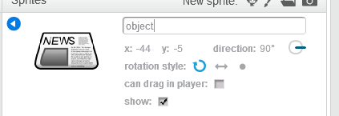
+ Resize the sprite by clicking on the **Shrink** button at the top
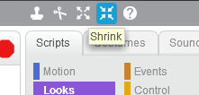
+ Click on the Sprite in the main stage window several times, until it is smaller than the cat
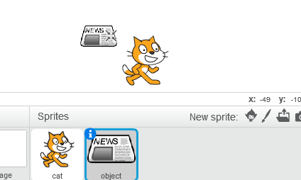

##### Get the rubbish to fall from the sky
+ Create a variable that will control the speed the rubbish falls, called **speed**
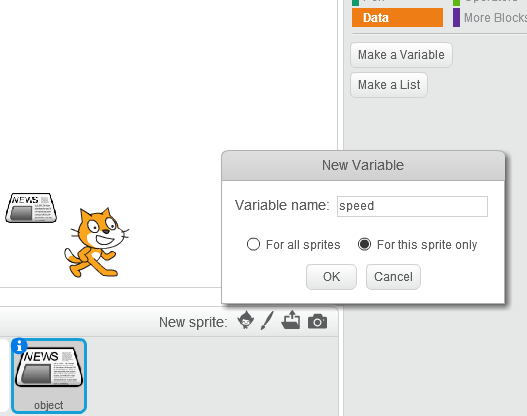
+ Untick the variable so the value isn't shown on the main stage
+ Create a custom block called **reset** that will set the speed to 0 at the start
```blocks
define reset
    set [speed v] to (0)
    hide
```
+ Create a custom block called **falling** that will make the object fall at this speed
```blocks
define falling
    forever
        change y by (speed)
        if <(y position) < (-140)> then
            set y to (-140)
        end
        if <(speed) > (0)> then
            turn left (15) degrees
        end
        if <(speed) < (0)> then
            turn right (15) degrees
        end
```
+ Create a custom block called **gravity** that will make it speed up as it falls, but stop when it hits the ground
```blocks
define gravity
    forever
        if <(y position) > (-140)> then
            change [speed v] by (-1)
        else
            set [speed v] to (0)
        end
```
+ Create a custom block called **choose object type** that will choose a type of rubbish
```blocks
define choose object type
    repeat (pick random (1) to (10))
		next costume
```
+ Create a custom block called **start at the top** that makes each new bit of rubbish start at a different place
```blocks
define start at the top
	go to x: (pick random (-230) to (230)) y: (180)
```
+ Create a custom block called **new object every four seconds**
```blocks
define new object every four seconds
    forever
        create clone of [myself v]
        wait (4) secs
```
+ Bring it all together by creating the following script
```blocks
when green flag clicked
    reset :: custom
    new object every four seconds :: custom
when I start as a clone
    choose object type :: custom
    start at the top :: custom
    show
when I start as a clone
    gravity :: custom
when I start as a clone
    falling :: custom
```

## Test Your Project {.flag}

Click the green flag. The cat should still be able to run around, but now rubbish should rain from the sky, spinning as it falls.

## Save your project {.save}

## Things to try {.try}

+ Try changing **new object every four seconds** to make rubbish fall more or less often
+ Try changing **gravity** to change the speed that objects fall

# Step 3: Carrying the rubbish {.activity}

Now we want to make the cat to be able to pick up fallen rubbish and carry it.

## Activity Checklist {.check}

Select the rubbish object sprite.

##### Create variables that will let us describe the different costumes of object
+ Create a new variable, for this sprite only, called **can**
+ Create a new variable, for this sprite only, called **jar**
+ Create a new variable, for this sprite only, called **newspaper**
+ Untick them all so they're not shown on the stage
+ Modify the existing **reset** custom block so that it looks like this. The numbers should match the costume numbers for the sprite.
```blocks
define reset
    set [speed v] to (0)
    set [can v] to (1)
    set [jar v] to (2)
    set [newspaper v] to (3)
    hide
```

##### Create variables to control what the cat is carrying
+ Create a new variable, for this sprite only, called **nothing**
+ Create a new variable, **for all sprites**, called **carrying**
+ Untick them both so they're not shown on the stage
+ Modify the existing **reset** custom block, to include setting both **nothing** and **carrying** to 4. It should end up looking like this.
```blocks
define reset
    set [speed v] to (0)
    set [can v] to (1)
    set [jar v] to (2)
    set [newspaper v] to (3)
    set [nothing v] to (4)
    set [carrying v] to (4)
    hide
```

##### Control how objects can be carried
+ Create a new custom block called **wait to be carried** that lets the cat pick up an object if it's not already carrying something. This will include creating a new event to broadcast **carry-change**
```blocks
define wait to be carried
    wait until <<(carrying) = (nothing)> and <touching [cat v]>>
    set [carrying v] to (costume #)
    broadcast [carry-change v]
    repeat until <key [space v] pressed?>
        go to x: ([x position v] of [cat v]) y: (y position)
    end
    set [carrying v] to (nothing)
    wait (1) secs
    wait to be carried
```
+ Create a new script so each new piece of rubbish can be carried
```blocks
when I start as a clone
    wait to be carried :: custom
```

## Test Your Project {.flag}

Try out your game again.

The cat can carry an item of rubbish, and will drop it when you press the space bar.

## Save your project {.save}

# Step 4: Throwing the rubbish {.activity}

The next step is for the cat to be able to throw the rubbish it's carrying into the air instead of dropping it.

## Activity Checklist {.check}

+ Create a custom block called **throw in the air**
```blocks
define throw in the air
    set [carrying v] to (nothing)
    broadcast [carry-change v]
    set y to (-139)
    set [speed v] to (20)
```

+ Modify the existing **wait to be carried** block so that the cat throws the object instead of dropping it when you press space. It should end up like this.
```blocks
define wait to be carried
    wait until <<(carrying) = (nothing)> and <touching [cat v]>>
    set [carrying v] to (costume #)
    broadcast [carry-change v]
    repeat until <key [space v] pressed?>
        go to x: ([x position v] of [cat v]) y: (y position)
    end
    throw in the air :: custom
    wait until <(y position) > (0)>
    wait to be carried
```

## Test Your Project {.flag}

Try out your game again.

The cat can carry an item of rubbish, and will throw it in the air when you press the space bar. It will fall back to the ground and can be picked up again.

## Save your project {.save}

# Step 5: Creating recycling bins {.activity}

## Activity Checklist {.check}

##### Start by setting up a background for the bins.
+ Click on **Stage**
+ Click on the **Backdrops** tab
+ Click on **Choose backdrop from library** and choose a background like **boardwalk**
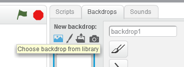
+ Delete the original blank backdrop 'backdrop1'

##### Add bins to the background
+ Click on **Convert to vector**
+ Click on **Import** on the Backdrops tab
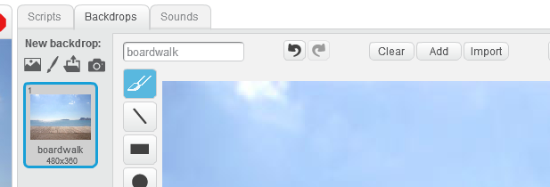
+ Choose **Resources/bin.png**
+ Click on **Select**
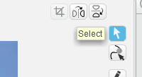
+ Select the bin and move and resize it to put it on the boardwalk path
+ Add two more bins so it ends up looking something like this:
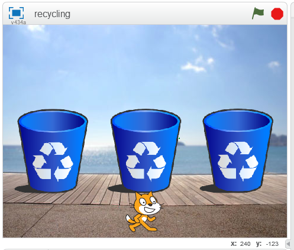

##### Add labels to the bins
+ Click on **Text**
+ Add labels to the bins - one for metal, one for glass, one for paper
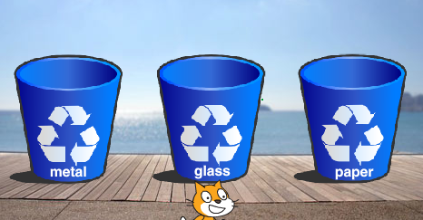

##### Add the bin openings
+ Click on **Paint new sprite**
+ Click on the Costumes tab
+ Click on **Convert to vector**
+ Draw a filled oval that matches the opening for one of the bins
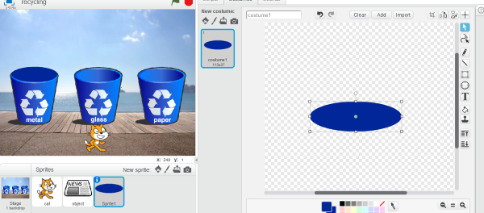
+ Click on the blue `i` and rename the Sprite to **bin-can**
+ Add a script that draws the bin behind thrown rubbish
```blocks
when green flag clicked
    go back (5) layers
```
+ Duplicate the sprite
+ Call the duplicate **bin-jar**
+ Move it to cover the second bin opening
+ Duplicate the sprite again
+ Call the duplicate **bin-newspaper**
+ Move it to cover the third bin opening


##### Get the rubbish to go in the bins
+ Click on the **object** sprite
+ Create a new custom block called **rubbish binned**
```blocks
define rubbish binned
    delete this clone
```
+ Create a new custom block called **go in the bin**
```blocks
define go in the bin
    repeat until <(y position) > (20)>
        if <<(costume #) = (can)> and <touching [bin-can v]>> then
            rubbish binned :: custom
        else
            if <<(costume #) = (jar)> and <touching [bin-jar v]>> then
                rubbish binned :: custom
            else
                if <<(costume #) = (newspaper)> and <touching [bin-newspaper v]>> then
                    rubbish binned :: custom
                end
            end
        end
```
+ Modify the existing **wait to be carried** custom block so that thrown objects can go in the bin instead of falling back down. It should end up looking like this.
```blocks
define wait to be carried
    wait until <<(carrying) = (nothing)> and <touching [cat v]>>
    set [carrying v] to (costume #)
    broadcast [carry-change v]
    repeat until <key [space v] pressed?>
        go to x: ([x position v] of [cat v]) y: (y position)
    end
    throw in the air :: custom
    go in the bin :: custom
    wait to be carried
```

## Test Your Project {.flag}

Try out your game again.

The cat can now throw items into bins. Items will only go into the correct bins, otherwise they'll fall back down onto the ground.

## Save your project {.save}

# Step 6: Keep score {.activity}

+ Create a new variable, **for all sprites**, called **score**
+ Move the score variable in the stage up into the corner
+ Modify the custom **reset** block in the scripts for the rubbish objects to reset the score to 0, so it should look like:
```blocks
define reset
    set [speed v] to (0)
    set [can v] to (1)
    set [jar v] to (2)
    set [newspaper v] to (3)
    set [nothing v] to (4)
    set [carrying v] to (4)
    set [score v] to (0)
    hide
```
+ Modify the custom **rubbish binned** block so that it adds to the score. It should look like:
```blocks
define rubbish binned
    change [score v] by (1)
    delete this clone
```

## Test Your Project {.flag}

Try out your game again.

The cat gets a point for every item that is put into the correct recycling bin.

## Save your project {.save}

Well done, you’ve finished! Now you can enjoy your game!

Don’t forget you can share your game with all your friends and family by clicking on **Share** on the menu bar!
